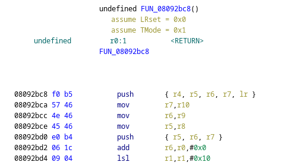
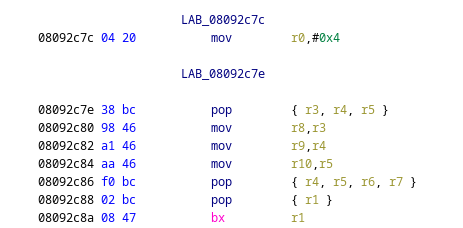
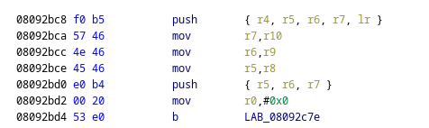
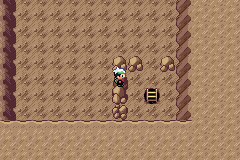
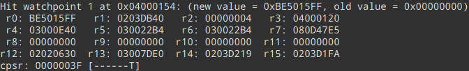
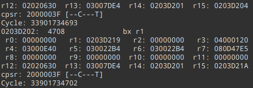
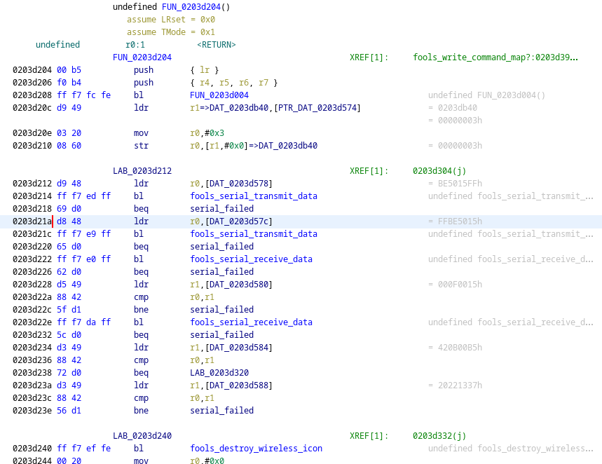
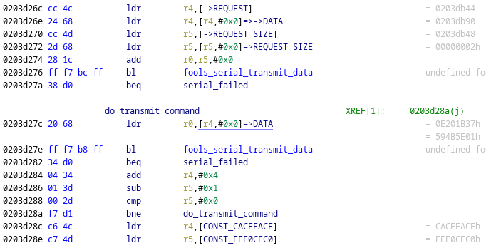
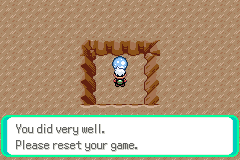

#  TheZZAZZGlitch's April Fools Event 2022 - Cracker Cavern Reborn challenges

It's been an entire year already, and ZZAZZ has once again blessed us with yet
another April Fools event. Since last year I have not done a proper writeup (because of
laziness), I've decided to change that this year. Prepare yourself for some terrible 
writing and, *drum roll*, ARMv4 reverse-engineering.

## Intro

Compared to previous years, this year's event is based on a Pokémon Emerald 
save file, which increased the difficulty of reversing a bit. 
Coming from bgb with an all-in-one debugger to a "modern" day console requires 
a little bit of adapting, but nothing too terrifying.  

## Cracker Cavern 1

As is tradition, the very first challenge is a simple "defeat the obstacle" 
kind of challenge. We are tasked with going around a boulder blocking access 
to the next level. Usually there are checks in place for common "walk-through-walls"
cheats, and so I went for my usual strategy of manually patching the collision 
functions. 

The first step is of course to locate the collision functions in memory. Let's 
look at a [symbol file](https://github.com/pret/pokeemerald/blob/symbols/pokeemerald.sym) 
for Pokémon Emerald and do a quick search for ```Collision``..

```
    ...
0808afbc l 0000006c CheckForPlayerAvatarCollision
0808b028 l 0000006c CheckForPlayerAvatarStaticCollision
0808b094 g 000000ce CheckForObjectEventCollision
0808b164 l 00000056 CheckForObjectEventStaticCollision
    ...
```

That sounds good! After looking at the [Emerald decompilation project](https://github.com/pret/pokeemerald) 
done by the incredible pret community (shoutouts!), I can see that these functions use ```GetCollisionAtCoords``` 
to validate collision at a specific point and direction in the map. This'll be a perfect target
for patching. Let's open up Ghidra, load the game ROM (making sure to set the proper
language as **ARMv4T-Little** and the proper image base to **0x08000000**), and go to the function (which is at ```0x08092bc8```)



The first 5 instructions are the function prologue, we want to preserve this. We can start overwriting
the function from the ```add``` instruction onwards. But what do we even want to do? If we scroll a little further down...



This is the function epilogue! We can see that one branch of the function saves a value to register ```R0```, and 
immediately goes into the epilogue (which restores registers that are supposed to be saved by the called function).  
We now know that the function returns the value in the ```R0``` register*, which means we are basically done.
What we want to do now, is patch the function above to set ```R0``` to some value, and then jump to the epilogue.
What value should we set it to? Based on the decompilation, we want ```COLLISION_NONE```, of course! Again, looking
at the decompilation, [we can get its numeric value](https://github.com/pret/pokeemerald/blob/master/include/global.fieldmap.h#L276).
It's the first entry in the enumeration, and so we expect it to be 0.  
We have everything we need - it's time to patch the function using Ghidra's built-in patching function.  



Ghidra helpfully shows us what the bytes of the instructions are, and it's just a matter of using
a memory viewer in your favourite emulator to edit the bytes at this address.



And it works!

## Cracker Cavern 2

We are now tasked with accessing a map with a certain ID. 
Same as a few years back, every single map has an ID associated with it. The question 
is: how do we force the game to access a specific map?

The save communicates with the server by using the GBA's [serial port](http://problemkaputt.de/gbatek.htm#gbacommunicationports),
which is normally used for link-cable connection and the like. A good start would be to set up
a watchpoint on the address used for transmitting data to see what makes it out to the running client. 
At this point, I had already set up GDB for easy access to debugging functionality, but you could
theoretically do it using your emulator's debugger console. 

After setting that up, let's try travelling through a map and see what happens.



Predictably, we hit our watchpoint. On the ARMv4T architecture, r15 is used as a Program Counter (PC),
and its value is currently pointing into the EWRAM region*. Great, this will probably be
where the events' functions will be. We want to know what is happening there, so at this point I opted to 
dump the entire EWRAM region to a file, and open it up in Ghidra (while setting up proper address bases and architecture).

At this point, it's important to note that EWRAM is **NOT** just code, so we can't go disassembling random
bytes and hoping to find something because it just might be some random data that just happened to be there. 
We also can't expect Ghidra to magically know where the code is, but we do know one address - 
```0x0203D1FA```, and we can start our disassembly there.

We land in a function that does a load and then stores some values to the Serial I/O
GBA registers, calls another function and then returns. This seems to be
a helper for doing write operations on the serial port - it's good to keep it in mind and label it for later, but for now 
let's skip over this function until it returns..



We have a new function. After disassembling it in Ghidra..



_Ignore the labels spoiling stuff - i'm too lazy to recreate this from the beginning :^)_

Perfect! It has a bunch of calls to the transmit function we've just seen, and it seems to be doing 
some interesting things. After each call to the transmit function, it does a conditional jump
to some label - which I can safely guess that is some "transmit failed" handling. However, the things it's 
sending look like magic values, maybe part of some higher-level protocol, so for now let's skip over this and look further.
It looks like it's disabling interrupts, setting up some addresses, and...



**Bingo!** We have what looks like a loop over words in memory, with each one being passed into the transmit function
we've seen before! But where does the data come from? Thankfully, Ghidra helps with deciphering this mess (which comes 
from the fact that loading an arbitrary 32-bit immediate is not possible under ARMv4, and it 
has to be done through a memory load and not a single move instruction). 

Based on that, we can see that the loop iterates over words from **0x0203db90**, and it does so for **2** words. 
After trying a few more map load requests, they all seem to be sending data from **0x0203db90**, which from now on is 
our prime target for reversing. You can see some example requests in the [net.md](docs/net.md) file.

Based on these few requests, the format seems easy enough:
```
01  ??  ??  ??  MM MM X? Y?
```
All map requests start with a ```01``` byte, then proceeded by 3 unknown bytes,
then followed by a 2-byte map ID and finally (what I assume) is the player position in the map.

However, what's up with the 3 semi-random bytes in the first word of the command? It turns out that is a "checksum", and 
just blindly modifying the map ID will not let you enter the map - you'll instead land in a Mystery Zone.
By putting write breakpoints on the command buffer, we eventually reach a function at ```0x0203d366``` that prepares
the command buffer for a map request. It writes the ```0x01``` value corresponding to a map request command, copies the 
target map ID and player coordinates, and does the following steps on the resulting buffer: 
- Loads a byte from ```0x03005d80``` into the second byte of the first word, i.e. right after the command type ```0x01```. 
- Calculates a 2-byte checksum using the following algorithm. Only the lower 16-bits of the resulting ```magic``` are used.
```
magic = 0xF0DBEB15
for each word in data buffer {
    magic = rotr(magic, 5)
    magic = magic ^ word   
    magic = (xored + 2*word)
}
```

Alright, but what about that value in the second byte?

```
...
03005d80 g 00000004 gRngValue
...
```

Thankfully, it's part of the state of the internal Emerald RNG, so we can assume it's irrelevant for the purposes
of checking validity of a command. Knowing all of this, we can now create our own command request!
We want to request map 0x1337, and player position is irrelevant. Thus we get the following command bytes:
```
01 ?? ?? ?? 37 13 00 00
```
After inserting a random byte and calculating the checksum, we get:
```
01 B1 23 54 37 13 00 00
```

Knowing the buffer address and our command bytes is all we need to finish this challenge now! The only hard
part is modifying the buffer to the right data. You could probably do it with cheat codes to freeze the buffer to a 
certain value, but I chose to break right at the beginning of the map request function, replace the contents
of the buffer, and resume (while quickly reconnecting the Fools client, as it disconnects when emulation is halted).



My job here is done!

## Cracker Cavern 3

This is where the real fun begins! To move forward, we need to find a password that is accepted by the NPC.    


## Cracker Cavern 4


