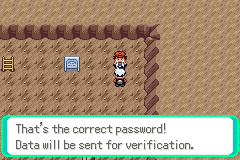
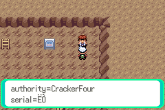
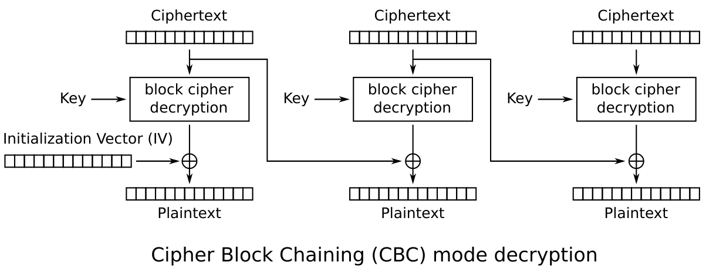

#  TheZZAZZGlitch's April Fools Event 2022 - Cracker Cavern Reborn challenges

It's been an entire year already, and ZZAZZ has once again blessed us with yet
another April Fools event. Since last year I have not done a proper writeup (because of
laziness), I've decided to change that this year. Prepare yourself for some terrible 
writing and, *drum roll*, ARMv4 reverse-engineering.

# Intro

Compared to previous years, this year's event is based on a Pokémon Emerald 
save file, which increased the difficulty of reversing a bit. 
Coming from bgb with an all-in-one debugger to a "modern" day console requires 
a little bit of adapting, but nothing too terrifying. Also, GBATEK documentation is a godsend when doing
anything on the GBA.

# Cracker Cavern 1

As is tradition, the very first challenge is a simple "defeat the obstacle" 
kind of challenge. We are tasked with going around a boulder blocking access 
to the next level. Usually there are checks in place for common "walk-through-walls"
cheats, and so I went for my usual strategy of manually patching the collision 
functions. 

The first step is of course to locate the collision functions in memory. Let's 
look at a [symbol file](https://github.com/pret/pokeemerald/blob/symbols/pokeemerald.sym) 
for Pokémon Emerald and do a quick search for ```Collision``..

```
    ...
0808afbc l 0000006c CheckForPlayerAvatarCollision
0808b028 l 0000006c CheckForPlayerAvatarStaticCollision
0808b094 g 000000ce CheckForObjectEventCollision
0808b164 l 00000056 CheckForObjectEventStaticCollision
    ...
```

That sounds good! After looking at the [Emerald decompilation project](https://github.com/pret/pokeemerald) 
done by the incredible pret community (shoutouts!), I can see that these functions use ```GetCollisionAtCoords``` 
to validate collision at a specific point and direction in the map. This'll be a perfect target
for patching. Let's open up Ghidra, load the game ROM (making sure to set the proper
language as **ARMv4T-Little** and the proper image base to **0x08000000**), and go to the function (which is at ```0x08092bc8```)


The first 5 instructions are the function prologue, we want to preserve this. We can start overwriting
the function from the ```add``` instruction onwards. But what do we even want to do? If we scroll a little further down...


This is the function epilogue! We can see that one branch of the function saves a value to register ```R0```, and 
immediately goes into the epilogue (which restores registers that are supposed to be saved by the called function).  
We now know that the function returns the value in the ```R0``` register*, which means we are basically done.
What we want to do now, is patch the function above to set ```R0``` to some value, and then jump to the epilogue.
What value should we set it to? Based on the decompilation, we want ```COLLISION_NONE```, of course! Again, looking
at the decompilation, [we can get its numeric value](https://github.com/pret/pokeemerald/blob/master/include/global.fieldmap.h#L276).
It's the first entry in the enumeration, and so we expect it to be 0.  
We have everything we need - it's time to patch the function using Ghidra's built-in patching function.  


Ghidra helpfully shows us what the bytes of the instructions are, and it's just a matter of using
a memory viewer in your favourite emulator to edit the bytes at this address.


And it works!

# Cracker Cavern 2

We are now tasked with accessing a map with a certain ID. 
Same as a few years back, every single map has an ID associated with it. The question 
is: how do we force the game to access a specific map?

The save communicates with the server by using the GBA's [serial port](http://problemkaputt.de/gbatek.htm#gbacommunicationports),
which is normally used for link-cable connection and the like. A good start would be to set up
a watchpoint on the address used for transmitting data to see what makes it out to the running client. 
At this point, I had already set up GDB for easy access to debugging functionality, but you could
theoretically do it using your emulator's debugger console. 

After setting that up, let's try travelling through a map and see what happens.


Predictably, we hit our watchpoint. On the ARMv4T architecture, r15 is used as a Program Counter (PC),
and its value is currently pointing into the EWRAM region*. Great, this will probably be
where the events' functions will be. We want to know what is happening there, so at this point I opted to 
dump the entire EWRAM region to a file, and open it up in Ghidra (while setting up proper address bases and architecture).

At this point, it's important to note that EWRAM is **NOT** just code, so we can't go disassembling random
bytes and hoping to find something because it just might be some random data that just happened to be there. 
We also can't expect Ghidra to magically know where the code is, but we do know one address - 
```0x0203D1FA```, and we can start our disassembly there.

We land in a function that does a load and then stores some values to the Serial I/O
GBA registers, calls another function and then returns. This seems to be
a helper for doing write operations on the serial port - it's good to keep it in mind and label it for later, but for now 
let's skip over this function until it returns..


We have a new function. After disassembling it in Ghidra..


_Ignore the labels spoiling stuff - i'm too lazy to recreate this from the beginning :^)_

Perfect! It has a bunch of calls to the transmit function we've just seen, and it seems to be doing 
some interesting things. After each call to the transmit function, it does a conditional jump
to some label - which I can safely guess that is some "transmit failed" handling. However, the things it's 
sending look like magic values, maybe part of some higher-level protocol, so for now let's skip over this and look further.
It looks like it's disabling interrupts, setting up some addresses, and...


**Bingo!** We have what looks like a loop over words in memory, with each one being passed into the transmit function
we've seen before! But where does the data come from? Thankfully, Ghidra helps with deciphering this mess (which comes 
from the fact that loading an arbitrary 32-bit immediate is not possible under ARMv4, and it 
has to be done through a memory load and not a single move instruction). 

Based on that, we can see that the loop iterates over words from **0x0203db90**, and it does so for **2** words. 
After trying a few more map load requests, they all seem to be sending data from **0x0203db90**, which from now on is 
our prime target for reversing. You can see some example requests in the [net.md](docs/net.md) file.

Based on these few requests, the format seems easy enough:
```
01  ??  ??  ??  MM MM X? Y?
```
All map requests start with a ```01``` byte, then proceeded by 3 unknown bytes,
then followed by a 2-byte map ID and finally (what I assume) is the player position in the map.

However, what's up with the 3 semi-random bytes in the first word of the command? It turns out that is a "checksum", and 
just blindly modifying the map ID will not let you enter the map - you'll instead land in a Mystery Zone.
By putting write breakpoints on the command buffer, we eventually reach a function at ```0x0203d366``` that prepares
the command buffer for a map request. It writes the ```0x01``` value corresponding to a map request command, copies the 
target map ID and player coordinates, and does the following steps on the resulting buffer: 
- Loads a byte from ```0x03005d80``` into the second byte of the first word, i.e. right after the command type ```0x01```. 
- Calculates a 2-byte checksum using the following algorithm. Only the lower 16-bits of the resulting ```magic``` are used.

```
magic = 0xF0DBEB15
for each word in data buffer {
    magic = rotr(magic, 5)
    magic = magic ^ word   
    magic = (xored + 2*word)
}
```

Alright, but what about that value in the second byte?

```
...
03005d80 g 00000004 gRngValue
...
```

Thankfully, it's part of the state of the internal Emerald RNG, so we can assume it's irrelevant for the purposes
of checking validity of a command. Knowing all of this, we can now create our own command request!
We want to request map 0x1337, and player position is irrelevant. Thus we get the following command bytes:

```
01 ?? ?? ?? 37 13 00 00
```
After inserting a random byte and calculating the checksum, we get:

```
01 B1 23 54 37 13 00 00
```

Knowing the buffer address and our command bytes is all we need to finish this challenge now! The only hard
part is modifying the buffer to the right data. You could probably do it with cheat codes to freeze the buffer to a 
certain value, but I chose to break right at the beginning of the map request function, replace the contents
of the buffer, and resume (while quickly reconnecting the Fools client, as it disconnects when emulation is halted).


My job here is done!

# Cracker Cavern 3

This is where the real fun begins! To move forward, we need to find a password that is accepted by the NPC.
First, we need to locate the routine that verifies the given password, and afterwards we can reason about the
operations that it's doing. 

Initially, I tried searching for a place in memory where the password would be stored by dumping the RAM state
before and after entering the password - and to help with analysis, I wrote a little tool (```mdiff```) that compares
two files and finds ranges of consecutive bytes that differ. However, this approach didn't really work, and I couldn't 
find any obvious addresses where the password would be stored.

On second approach, by using GDB I tried interrupting the execution at random times after
entering the password, in hopes of finding any executed code in RAM that would belong to the save
file, but this also didn't give me any results. What I noticed, however, is that a lot of the breaks were hitting 
functions that were related to scripts.

```
0x08098e12 in ScriptReadHalfword (ctx=0x3000e40 <sScriptContext1>) at src/script.c:162
162         u16 value = *(ctx->scriptPtr++);
(gdb) bt
#0  0x08098e12 in ScriptReadHalfword (ctx=0x3000e40 <sScriptContext1>) at src/script.c:162
#1  0x0809991c in ScrCmd_addvar (ctx=0x3000e40 <sScriptContext1>) at src/scrcmd.c:467
#2  0x08098d86 in RunScriptCommand (ctx=0x3000e40 <sScriptContext1>) at src/script.c:113
#3  0x08098ed4 in ScriptContext2_RunScript () at src/script.c:215
#4  0x08085e2a in OverworldBasic () at src/overworld.c:1457
#5  0x08085e74 in CB2_Overworld () at src/overworld.c:1479
#6  0x08000534 in CallCallbacks () at src/main.c:185
#7  0x080004d4 in UpdateLinkAndCallCallbacks () at src/main.c:165
#8  0x08000496 in AgbMain () at src/main.c:144
#9  0x08000234 in Init ()
```

Not surprising, this is probably the NPC interaction script being hit. Maybe the password verification is being done at 
the script level? Let's check that! To do this, I put some breakpoints around [object script functions](https://github.com/pret/pokeemerald/blob/master/src/script.c#L28) - 
```InitScriptContext``` sounds like a perfect choice, ```Setup<...>Script``` variants and ```RunScriptCommand``` which is present in the backtrace should 
also work. Afterwards, let's talk to the NPC:

```
Breakpoint 4, InitScriptContext (ctx=0x3000e40 <sScriptContext1>, cmdTable=0x81db67c, cmdTableEnd=0x81dba08)
at src/script.c:32
32          ctx->mode = SCRIPT_MODE_STOPPED;
(gdb)
```

Success! The breakpoint was hit. Based on a quick look through the source code of InitScriptContext, it seems 
that scripts are stored as custom bytecode that is then interpreted by the game engine (keep in mind - I had no knowledge 
of the inner workings of the engine when doing these challenges). The script that is being executed is stored as
a pointer in the variable ```ctx->scriptPtr```. Let's go further - ```InitScriptContext``` only initializes that value 
to null, and we want to see where the bytecode is located. 

```
(gdb) c
Continuing.

Breakpoint 6, SetupBytecodeScript (ctx=0x3000e40 <sScriptContext1>, ptr=0x20182ad "jZ\017") at src/script.c:48
48          ctx->scriptPtr = ptr;
(gdb)
```

Aha! The script is now being set up with the proper bytecode, which GDB helpfully points out is at ```0x020182ad```.
Let's see what's there:

```gdb
(gdb) x/32x ptr
0x20182ad:      0x6a    0x5a    0x0f    0x00    0x93    0x89    0x01    0x02
0x20182b5:      0x09    0x04    0x04    0xfd    0x82    0x01    0x02    0x23
0x20182bd:      0x75    0xd0    0x03    0x02    0x27    0x04    0x5e    0x83
0x20182c5:      0x01    0x02    0x21    0x0d    0x80    0x00    0x00    0x06
(gdb)
```

I have no idea what the bytecode is - so let's consult the [Emerald disassembly](https://github.com/pret/pokeemerald/blob/master/asm/macros/event.inc)!
Opcode ```0x6a``` is a freeze all objects instruction (so the player can't move), ```0x5a``` turns the object towards 
the player, etc. This sounds promising, but we still don't know whether the script does anything interesting with the
password, and manually disassembling it is a hassle (especially when we don't know the size of the script). At this point,
I opted to go for the nuclear route of [writing my own script disassembler](tools/discript.cpp) to help facilitate 
the process. It loads a given binary file, and decodes the proper event opcodes. By dumping a sufficiently large memory 
region, starting from the address ```0x020182ad``` we can capture the entire script (and if it looks like something's 
missing, we can always dump more). Here is the script disassembly, with all the disassembler's fancy automatic function
discovery:

```
@Function 0x020182ad

0x020182ad  | freezeobjects
0x020182ae  | faceplayer
0x020182af  | loadword 0000, 0x02018993
0x020182b5  | callstd 4
0x020182b7  | call 0x020182fd
0x020182bc  | callnative 0x0203d075
0x020182c1  | waitstate
0x020182c2  | call 0x0201835e
0x020182c7  | compvar 800d, 0
0x020182cc  | goto_if 1, 0x020182f3
0x020182d2  | loadword 0000, 0x020189b6
0x020182d8  | callstd 4
0x020182da  | callnative 0x02018233
0x020182df  | call 0x0203e17c
Skipping analysis of 0x0203e17c - out of bounds. Did you copy the whole script?
0x020182e4  | playse 40
0x020182e7  | callnative 0x02018263
0x020182ec  | callnative 0x08089c35
0x020182f1  | release
0x020182f2  | exit

@Function 0x020182f3

0x020182f3  | loadword 0000, 0x020189f7
0x020182f9  | callstd 4
0x020182fb  | release
0x020182fc  | exit

@Function 0x020182fd

0x020182fd  | setptr 255, 0x02021dc4
0x02018303  | setptr 255, 0x02021dc5
0x02018309  | setptr 255, 0x02021dc6
0x0201830f  | setptr 255, 0x02021dc7
0x02018315  | setptr 255, 0x02021dc8
0x0201831b  | setptr 255, 0x02021dc9
0x02018321  | setptr 255, 0x02021dca
0x02018327  | setptr 255, 0x02021dcb
0x0201832d  | setptr 255, 0x02021dcc
0x02018333  | setptr 255, 0x02021dcd
0x02018339  | setptr 255, 0x02021dce
0x0201833f  | setptr 255, 0x02021dcf
0x02018345  | setptr 255, 0x02021dd0
0x0201834b  | setptr 255, 0x02021dd1
0x02018351  | setptr 255, 0x02021dd2
0x02018357  | setptr 255, 0x02021dd3
0x0201835d  | return

@Function 0x0201835e

0x0201835e  | setvar 0x8001, 0x1b39
0x02018363  | loadbytefromptr 0, 0x02021dc4
0x02018369  | setptrbyte 0, 0x02018372
0x0201836f  | addvar 0x8001, 0x00bb
0x02018374  | loadbytefromptr 0, 0x020375da
0x0201837a  | setptrbyte 0, 0x02018399
0x02018380  | loadbytefromptr 0, 0x020375db
0x02018386  | setptrbyte 0, 0x0201839a
... way too long for the writeup ...
... skipped for clarity          ...
0x02018981  | goto_if 5, 0x0201898d
0x02018987  | setvar 0x800d, 0x0001
0x0201898c  | return

@Function 0x0201898d

0x0201898d  | setvar 0x800d, 0x0000
0x02018992  | return
```

Good thing I didn't reverse this script manually, huh. Based on the length, I'm pretty sure that the verification is 
done in this script. Let's start with the function the script starts execution in:

```
@Function 0x020182ad

0x020182ad  | freezeobjects
0x020182ae  | faceplayer
0x020182af  | loadword 0000, 0x02018993
0x020182b5  | callstd 4
0x020182b7  | call 0x020182fd
0x020182bc  | callnative 0x0203d075
0x020182c1  | waitstate
0x020182c2  | call 0x0201835e
0x020182c7  | compvar 800d, 0
0x020182cc  | goto_if 1, 0x020182f3
0x020182d2  | loadword 0000, 0x020189b6
0x020182d8  | callstd 4
0x020182da  | callnative 0x02018233
0x020182df  | call 0x0203e17c
Skipping analysis of 0x0203e17c - out of bounds. Did you copy the whole script?
0x020182e4  | playse 40
0x020182e7  | callnative 0x02018263
0x020182ec  | callnative 0x08089c35
0x020182f1  | release
0x020182f2  | exit

@Function 0x020182f3

0x020182f3  | loadword 0000, 0x020189f7
0x020182f9  | callstd 4
0x020182fb  | release
0x020182fc  | exit

@Function 0x020182fd

0x020182fd  | setptr 255, 0x02021dc4
0x02018303  | setptr 255, 0x02021dc5
0x02018309  | setptr 255, 0x02021dc6
0x0201830f  | setptr 255, 0x02021dc7
0x02018315  | setptr 255, 0x02021dc8
0x0201831b  | setptr 255, 0x02021dc9
0x02018321  | setptr 255, 0x02021dca
0x02018327  | setptr 255, 0x02021dcb
0x0201832d  | setptr 255, 0x02021dcc
0x02018333  | setptr 255, 0x02021dcd
0x02018339  | setptr 255, 0x02021dce
0x0201833f  | setptr 255, 0x02021dcf
0x02018345  | setptr 255, 0x02021dd0
0x0201834b  | setptr 255, 0x02021dd1
0x02018351  | setptr 255, 0x02021dd2
0x02018357  | setptr 255, 0x02021dd3
0x0201835d  | return 
```

It seems to be calling a dialog popup function, setting some values to ```0xFF``` (function ```0x020182fd```), calling
a native function (which is just a function call to a specific address in memory), and waits on something (which stops the 
script from executing until it's unblocked, presumably by the native function at ```0x0203d075```).
A huge script function is then called, following which a value in a script variable* is compared - this is probably 
a return value indicating validation status! The script then does some more bookkeeping like displaying
a dialog indicating a success or failure, and (presumably) calling the server with the result on success.

This is a lot of information, but what's important is the script function ```0x0201835e```, which implements the 
password validator. This'll be our main target for reversing now. But before that - the 16-byte sequence that is being 
reset to ```0xFF``` before calling a function at ```0x0203d075``` looks awfully like it would be the input password - a
quick GDB check confirms that is indeed the case, the password is stored there as [a custom character format used by the engine](https://github.com/pret/pokeemerald/blob/master/gflib/characters.h).
For clarity, using the magic of "Find and Replace" I renamed all the addresses to ```Rn```, where ```n``` is the index 
of the character in the password.

Let's now look at the function  ```0x0201835e```. It may seem like a lot at first glance, but after staring at it for a 
bit you can see that it is mostly the same operations done multiple times, with certain data changed. 

```
@Function 0x0201835e

0x0201835e  | setvar 0x8001, 0x1b39
0x02018363  | loadbytefromptr 0, R0
0x02018369  | setptrbyte 0, 0x02018372      ;  bb replaced with R0
0x0201836f  | addvar 0x8001, 0x00bb         ;  0x8001 = 0x1b39 + R0
0x02018374  | loadbytefromptr 0, 0x020375da
0x0201837a  | setptrbyte 0, 0x02018399      ; [0x02018399] = [0x020375da] / low{0x8001}
0x02018380  | loadbytefromptr 0, 0x020375db
0x02018386  | setptrbyte 0, 0x0201839a      ; [0x0201839a] = [0x020375db] / high{0x8001}

0x0201838c  | setvar 0x8001, 0x0000
0x02018391  | setvar 0x8002, 0x0049
0x02018396  | addvar 0x8001, 0x1bf4         ;  the half-word is [0x020375db][0x020375da]
0x0201839b  | subvar 0x8002, 0x0001         ;  0x8001 = [0x020375db][0x020375da],
0x020183a0  | compvar 8002, 0               ;  i.e. 0x8001 of previous iteration
0x020183a5  | goto_if 5, 0x02018396         ;
0x020183ab  | addvar 0x8001, 0x18df         ;  0x8001 = 0x49 * 0x8001 + 0x18df
0x020183b0  | loadbytefromptr 0, R1
0x020183b6  | setptrbyte 0, 0x020183bf      ;  bb replaced with R1
0x020183bc  | addvar 0x8001, 0x00bb         ;  0x8001 = 0x8001 + R1
0x020183c1  | loadbytefromptr 0, 0x020375da
0x020183c7  | setptrbyte 0, 0x020183e6      ;  [0x020183e6] = [0x020375da]
0x020183cd  | loadbytefromptr 0, 0x020375db
0x020183d3  | setptrbyte 0, 0x020183e7      ;  [0x020183e7] = [0x020375db]

...
```

Looking from the start, the script sets a variable to the value ```0x1b39```, and then loads the byte from ```R0``` 
which is used to...modify the script itself?

That's right, the entire script is full of self-modifying code! Thankfully for us, the self-modification
doesn't change the general control flow (otherwise I would have probably lost my mind). Instead, what it does is
it changes the value that is added in the following ```addvar``` opcode, resulting in the operation ```var[0x8001] = 0x1b39 + R0```.  
Afterwards, we have more self-modifying code, this time setting two bytes further in the function to bytes from ```0x020375db``` and ```0x020375da```.

Following these operations, we do some more operations on the ```0x8001``` variable. We multiply the value ```0x1bf``` 
```0x49``` times, and the result is put into ```0x8001```...or is it? Looking at the previous block of operations, we 
can see that the ``addvar`` opcode is modified at runtime - the added value is modified to be the bytes from
```0x020375db``` and ```0x020375da``` respectively. But what do these addresses contain? 

```
...
020375d8 g 00000002 gSpecialVar_0x8000
020375da g 00000002 gSpecialVar_0x8001
020375dc g 00000002 gSpecialVar_0x8002
020375de g 00000002 gSpecialVar_0x8003
...
```

It's actually the in-memory address of the ```0x8001``` variable! The self-modification makes it so that the loop 
actually just multiplies ```0x8001``` by ```0x49```. After the loop, the value of ```0x18df``` is added, which boils down
to the operation:

```0x8001 = 0x49 * 0x8001 + 0x18df```

Afterwards, the script does the exact same thing as in the first block, which is add a value of the input (this time, 
the value added is ```R1```), and modify the **following** opcodes (which also happens to be an ```addvar``` instruction).

The rest of the script goes exactly like above, which is essentially:
``` 
v = M * 0x8001 + C 
0x8001 = v + Rn
```

The values for the different iterations are as follows:

- **Pre:** out = 0x1b39 + R0
- **Iteration 0:** M = 0x0049, C = 0x18df, Rn = R1
- **Iteration 1:** M = 0x0061, C = 0x13eb, Rn = R2
- **Iteration 2:** M = 0x000d, C = 0x11ef, Rn = R3
- **Iteration 3:** M = 0x0029, C = 0x1145, Rn = R4
- **Iteration 4:** M = 0x0043, C = 0x12df, Rn = R5
- **Iteration 5:** M = 0x0065, C = 0x0dfd, Rn = R6
- **Iteration 6:** M = 0x0059, C = 0x13af, Rn = R7
- **Iteration 7:** M = 0x008b, C = 0x149f, Rn = R8
- **Iteration 8:** M = 0x0047, C = 0x0fef, Rn = R9
- **Iteration 9:** M = 0x0053, C = 0x0fb5, Rn = R0
- **Iteration 10:** M = 0x003b, C = 0x0e75, Rn = R1
- **Iteration 11:** M = 0x00b5, C = 0x11fb, Rn = R2
- **Iteration 12:** M = 0x007f, C = 0x1237, Rn = R3
- **Iteration 13:** M = 0x00a3, C = 0x125f, Rn = R4
- **Iteration 14:** M = 0x0067, C = 0x107b, Rn = R5
- **Iteration 15:** M = 0x00a3, C = 0x1951, Rn = R6
- **Iteration 16:** M = 0x0095, C = 0x1b47, Rn = R7
- **Iteration 17:** M = 0x00c1, C = 0x151f, Rn = R8
- **Iteration 18:** M = 0x00d3, C = 0x14b1, Rn = R9
- **Iteration 19:** M = 0x0097, C = 0x13eb

Immediately, we can notice that **input characters R10+ are never used**! 
This means only the first 10 characters will actually matter for the validity of a password.
The last iteration is also special, as no input is actually added. Furthermore:

```
0x0201894d  | setvar 0x8001, 0x0000
0x02018952  | setvar 0x8002, 0x0097
0x02018957  | addvar 0x8001, 0x19ec
0x0201895c  | subvar 0x8002, 0x0001
0x02018961  | compvar 8002, 0
0x02018966  | goto_if 5, 0x02018957
0x0201896c  | addvar 0x8001, 0x13eb
0x02018971  | compvar 8003, 45295
0x02018976  | goto_if 5, 0x0201898d
0x0201897c  | compvar 8001, 54457
0x02018981  | goto_if 5, 0x0201898d
0x02018987  | setvar 0x800d, 0x0001
0x0201898c  | return

@Function 0x0201898d

0x0201898d  | setvar 0x800d, 0x0000
0x02018992  | return
```

After the final iteration, the values in ```0x8001``` and ```0x8003``` are compared to constants
```45295``` and ```54457``` - when they're equal, the function sets ```0x800d``` to 1, which is the value
the main script function checks! 

But wait - variable ```0x8003```? The script never modified that variable, or so it would appear. During **iteration 9**,
after carrying out the multiplication/addition, but before adding the input value, **the variable ```0x8001``` is sneakily copied into 0x8003**, 
and the following iteration uses **a new ```0x8001``` value - a constant ```0x0539```**

```
0x02018641  | setvar 0x8001, 0x0000
0x02018646  | setvar 0x8002, 0x0053
0x0201864b  | addvar 0x8001, 0xad42
0x02018650  | subvar 0x8002, 0x0001
0x02018655  | compvar 8002, 0
0x0201865a  | goto_if 5, 0x0201864b
0x02018660  | addvar 0x8001, 0x0fb5
0x02018665  | copyvar 0x8003, 0x8001
0x0201866a  | setvar 0x8001, 0x0539
```

As such, iterations **0..=9** and **10..=19** are independent of each other, and the final computed value
is then used to check validity of the password. 

Alright, the algorithm is now clear, but how do we go from knowing the constraints to generating a valid password?
Well, we know that the input is only constrained to a certain group of values (bytes representing valid characters in 
the engine that the input dialog actually allows us to choose), only the first 10 characters actually matter, and..

Wait, what are you doing? No, **put that down**!

```python
from z3 import *

multipliers = [
    0x0049, 0x0061, 0x000d, 0x0029,
    0x0043, 0x0065, 0x0059, 0x008b,
    0x0047, 0x0053, 0x003b, 0x00b5,
    0x007f, 0x00a3, 0x0067, 0x00a3,
    0x0095, 0x00c1, 0x00d3, 0x0097
]

offsets = [
    0x18df, 0x13eb, 0x11ef, 0x1145,
    0x12df, 0x0dfd, 0x13af, 0x149f,
    0x0fef, 0x0fb5, 0x0e75, 0x11fb,
    0x1237, 0x125f, 0x107b, 0x1951,
    0x1b47, 0x151f, 0x14b1, 0x13eb
]

regs = [
    BitVec('s0', 16),
    BitVec('s1', 16),
    BitVec('s2', 16),
    BitVec('s3', 16),
    BitVec('s4', 16),
    BitVec('s5', 16),
    BitVec('s6', 16),
    BitVec('s7', 16),
    BitVec('s8', 16),
    BitVec('s9', 16),
    BitVec('s10', 16),
    BitVec('s11', 16),
    BitVec('s12', 16),
    BitVec('s13', 16),
    BitVec('s14', 16),
    BitVec('s15', 16),
]

x8003 = 0x1b39 + regs[0]
for i in range(0, 10):
    off = regs[(i + 1) % 10] if i != 9 else 0
    x8003 = multipliers[i] * x8003 + offsets[i] + off

x8001 = 0x0539 + regs[0]
for i in range(0, 10):
    off = regs[(i + 1) % 10] if i != 9 else 0
    x8001 = multipliers[10 + i] * x8001 + offsets[10 + i] + off

print(x8003)
print(x8001)

solver = Solver()
solver.add(x8003 == 45295)
solver.add(x8001 == 54457)
for v in regs:
    solver.add(And(UGT(v, 0xBB), ULT(v, 0xEE)))
print(solver.check())
print("traversing model...")
for d in solver.model().decls():
    print("%s = %s" % (d.name(), solver.model()[d]))
print(solver.assertions())
```

_haha z3 goes brrrr_

Using z3, it's laughably easy to find a valid password that matches the "checksum". One thing to note here is that 
the input variables are defined as 16-bits, as otherwise z3 assumed the outputs are the same size (8-bit), which is wrong. 
To make sure the inputs are representable as bytes, and as input on the keyboard, 
I limit them to lower and upper case characters, [whose values you can find in the Emerald disassembly project](https://github.com/pret/pokeemerald/blob/master/gflib/characters.h).

Here is one valid password, generated by z3:

```
s9 = 192
s14 = 192
s3 = 234
s6 = 220
s2 = 199
s11 = 192
s15 = 192
s4 = 200
s12 = 192
s1 = 210
s0 = 215
s8 = 224
s7 = 234
s5 = 222
s13 = 192
s10 = 192
```

After converting these to characters, and entering it in the dialog: 



Success!

## Cracker Cavern 4 

### Disclaimer: 

I know little to nothing about cryptography - please take any knowledge presented here with a grain of salt, because 
it might be completely wrong (I do my best to verify). 

The final challenge - we are tasked with generating a "Gold" Certificate.
The NPC on the map can generate a new "Silver" Certificate of Commendation for us with a certain holder name, and afterwards allows us 
to appraise it, which presents some information about the generated cert, although it seems that it has problems displaying 
the serial number. The certificates are supposedly encrypted using AES, which would be done server-side in that case.



I started by looking in memory for known strings in the cert (that is, ```auth``` = ```0xd5 0xe9 0xe8 0xdc``` 
in the engine character set), which found a match around memory address ```0x02021dc0```. After appraising the cert, there's 
a small time period (before being mangled into the poke text format) in which the buffer at this address contains the raw appraisal data:

```
00000000  53 00 00 00 61 75 74 68  6f 72 69 74 79 3d 43 72  |S...authority=Cr|
00000010  61 63 6b 65 72 46 6f 75  72 2f 73 65 72 69 61 6c  |ackerFour/serial|
00000020  3d 34 38 35 38 36 36 37  2f 68 6f 6c 64 65 72 3d  |=4858667/holder=|
00000030  41 65 6c 69 74 61 2f 74  79 70 65 3d 73 69 6c 76  |Aelita/type=silv|
00000040  65 72 ff 00 00 00 00 00  00 00 00 00 00 00 00 00  |er..............|
00000050  00 00 00                                          |...|
```

Great, we now know more things about the certificate than the dialog shows. It seems like the appraisal data received 
consists of a series of key/value pairs separated by a forward slash. At the end there's an ```0xFF``` byte, which
is presumable some sort of terminator (the received string might be of arbitrary length).

How about the renewal process? What is sent to the server? Using the reverse-engineered knowledge of the network protocol
from CC2, I located the serial transmit buffer when renewal is being done (which is at ```0x020186d0```) and the received 
data from the server.  

```
00000000  07 00 00 00 68 6f 6c 64  65 72 3d 41 65 6c 69 74  |....holder=Aelit|
00000010  61 2f 74 79 70 65 3d 73  69 6c 76 65 72 ff 00 00  |a/type=silver...|
```

This is the command sent to the server when requesting a renewal. The holder name is sent, along with the
requested certificate type. 

```
00000000  49 54 49 6e 70 2b 68 63  53 77 66 50 32 43 35 72  |ITInp+hcSwfP2C5r|
00000010  76 54 41 79 79 69 72 47  44 73 78 58 57 78 6c 70  |vTAyyirGDsxXWxlp|
00000020  52 50 70 79 78 34 56 41  72 6e 41 52 63 76 37 6d  |RPpyx4VArnARcv7m|
00000030  42 76 33 71 38 31 63 6b  4b 4c 6f 54 44 50 33 42  |Bv3q81ckKLoTDP3B|
00000040  78 31 6a 6c 37 70 6f 46  37 59 70 5a 76 56 67 38  |x1jl7poF7YpZvVg8|
00000050  5a 59 70 4b 32 41 3d 3d  ff 00 00 00              |ZYpK2A==....|
```

This is the data received in return. It's base64, along with the same ```0xFF``` terminator byte. It's important
to note that these commands are **padded to 4 bytes**. After decoding the base64, we get the following bytes: 

```
00000000  21 32 27 a7 e8 5c 4b 07  cf d8 2e 6b bd 30 32 ca  |!2'..\K....k.02.|
00000010  2a c6 0e cc 57 5b 19 69  44 fa 72 c7 85 40 ae 70  |*...W[.iD.r..@.p|
00000020  11 72 fe e6 06 fd ea f3  57 24 28 ba 13 0c fd c1  |.r......W$(.....|
00000030  c7 58 e5 ee 9a 05 ed 8a  59 bd 58 3c 65 8a 4a d8  |.X......Y.X<e.J.|
```

Certainly looks like random data, which would confirm what the challenge introduction sign says.
If not AES, it's certainly encrypted. How about generating a different certificate? 

```
00000000  21 32 27 a7 e8 5c 4b 07  cf d8 2e 6b bd 30 32 ca  |!2'..\K....k.02.|
00000010  03 1e 25 1c 94 37 1d 43  cd bf eb a1 fe 18 63 bf  |..%..7.C......c.|
00000020  62 97 91 f5 7b de 29 d8  ec 0d 57 76 c5 31 52 fd  |b...{.)...Wv.1R.|
00000030  a8 4d be e1 6b 64 27 d9  fb b6 cd 98 1a a0 9a 82  |.M..kd'.........|
```

Interesting! The first **16 bytes** don't change, but the following 16-byte blocks do. 
The block size confirms the hint about AES, but the first block also tells us a lot about the 
type of encryption done to the data. The fact that it didn't change means that a **constant IV** 
and **K** is used for encrypting the different certificates. This also means that the underlying plaintext
decrypted by the first block is the exact same for all certificates. 

At this point, I changed my approach a little bit. Knowing that you'll probably need to generate a lot of
cerificates (_**hindsight: you didn't**_), using [mitmproxy](https://mitmproxy.org/) I reversed the API endpoints used between the client and the game
server (at least the ones used while generating certificates and appraising them). This allowed me to create a quick 
Python tool for requestion and appraising certs without having to use an emulator. You can check out
my findings in the [docs/api.md](docs/api.md) file. 

Knowing that the requested certificate type is sent to the server, we can attempt to request a gold one by simply
changing the "type" value. However, this obviously doesn't work, and the server does some checking on the request data 
beforehand.

```
Requesting certificate for 'Muzuwi', type 'gold'
Certificate request b64: b'BwAAAGhvbGRlcj1NdXp1d2kvdHlwZT1nb2xk/w==:'
Failed sending packet.
Error Response body: 'FoolsDescriptiveProcessingError('you may only generate silver certificates')'
```

How about the holder - can it be of arbitrary length? The answer is yes, it can!

```
Requesting certificate for 'AAAAAAAAAAAAAAAAAAAAAAAAAAAAAAAAAAAAAAAAAAAAAAAAAAAAAAAAAAAAAAAAAAAAAAAAAAAAAAAAAAAAAAAAAAAAAAAAAAAAAAAAAAAAAAAAAAAAAAAAAAAAAAAA', type 'silver'
Certificate request b64: b'BwAAAGhvbGRlcj1BQUFBQUFBQUFBQUFBQUFBQUFBQUFBQUFBQUFBQUFBQUFBQUFBQUFBQUFBQUFBQUFBQUFBQUFBQUFBQUFBQUFBQUFBQUFBQUFBQUFBQUFBQUFBQUFBQUFBQUFBQUFBQUFBQUFBQUFBQUFBQUFBQUFBQUFBQUFBQUFBQUFBQUFBQS90eXBlPXNpbHZlcv8=:'
<- Request content: SVRJbnAraGNTd2ZQMkM1cnZUQXl5b0d3NGFRWVR1WG9qdmRmdFQ4aXdUTkVZTy9PWVFpbStxdW43VnRCNTd5OVdOU2ErNUtDYzkzR3VpNVJ5dGdHOTJzaUJFWG1TVE9TSHFDYUZhdy9XdXMxQ25KcUVlbExsdklES2x3QWNLaEYxdWxBVHZuSXJXaFFML09uZWNBVVEwRG4ya2hnQm5XZU9XU3VyYTRFc0Vuend1RTUzam5DWFdSZWpwd2FTdG5GNGZvOTdhRDhHM1lSWG4wbjhOK3Q1TWhGRFdoL29SbXNGNjM0SGtPcmI5OXIxVnAzTFdIbGtJVTNUN0tOTGFjNf8=
```

And the underlying bytes of the decoded certificate are below. Again, the first block is the same as in the other certificates.

```
00000000  21 32 27 a7 e8 5c 4b 07  cf d8 2e 6b bd 30 32 ca  |!2'..\K....k.02.|
00000010  81 b0 e1 a4 18 4e e5 e8  8e f7 5f b5 3f 22 c1 33  |.....N...._.?".3|
00000020  44 60 ef ce 61 08 a6 fa  ab a7 ed 5b 41 e7 bc bd  |D`..a......[A...|
00000030  58 d4 9a fb 92 82 73 dd  c6 ba 2e 51 ca d8 06 f7  |X.....s....Q....|
00000040  6b 22 04 45 e6 49 33 92  1e a0 9a 15 ac 3f 5a eb  |k".E.I3......?Z.|
00000050  35 0a 72 6a 11 e9 4b 96  f2 03 2a 5c 00 70 a8 45  |5.rj..K...*\.p.E|
00000060  d6 e9 40 4e f9 c8 ad 68  50 2f f3 a7 79 c0 14 43  |..@N...hP/..y..C|
00000070  40 e7 da 48 60 06 75 9e  39 64 ae ad ae 04 b0 49  |@..H`.u.9d.....I|
00000080  f3 c2 e1 39 de 39 c2 5d  64 5e 8e 9c 1a 4a d9 c5  |...9.9.]d^...J..|
00000090  e1 fa 3d ed a0 fc 1b 76  11 5e 7d 27 f0 df ad e4  |..=....v.^}'....|
000000a0  c8 45 0d 68 7f a1 19 ac  17 ad f8 1e 43 ab 6f df  |.E.h........C.o.|
000000b0  6b d5 5a 77 2d 61 e5 90  85 37 4f b2 8d 2d a7 39  |k.Zw-a...7O..-.9|
```
 
At this point, I made an assumption - the data that is being encrypted is the exact same that is being
returned when appraising a specific certificate. This makes the "renewal" process done by the server **encryption** of 
(almost) arbitrary data, and "appraisal" is **decryption** of arbitrary data.
Under this assumption, the plaintext encrypted by our **oracle** - the event servers - is the following sequence (
generated by appraising, i.e. decrypting the certificate data):

```
00000000  61 75 74 68 6f 72 69 74  79 3d 43 72 61 63 6b 65  |authority=Cracke|
00000010  72 46 6f 75 72 2f 73 65  72 69 61 6c 3d 38 38 36  |rFour/serial=886|
00000020  37 37 31 30 2f 68 6f 6c  64 65 72 3d 41 41 41 41  |7710/holder=AAAA|
00000030  41 41 41 41 41 41 41 41  41 41 41 41 41 41 41 41  |AAAAAAAAAAAAAAAA|
00000040  41 41 41 41 41 41 41 41  41 41 41 41 41 41 41 41  |AAAAAAAAAAAAAAAA|
00000050  41 41 41 41 41 41 41 41  41 41 41 41 41 41 41 41  |AAAAAAAAAAAAAAAA|
00000060  41 41 41 41 41 41 41 41  41 41 41 41 41 41 41 41  |AAAAAAAAAAAAAAAA|
00000070  41 41 41 41 41 41 41 41  41 41 41 41 41 41 41 41  |AAAAAAAAAAAAAAAA|
00000080  41 41 41 41 41 41 41 41  41 41 41 41 41 41 41 41  |AAAAAAAAAAAAAAAA|
00000090  41 41 41 41 41 41 41 41  41 41 41 41 41 41 41 41  |AAAAAAAAAAAAAAAA|
000000a0  41 41 41 41 41 41 41 41  41 41 41 41 2f 74 79 70  |AAAAAAAAAAAA/typ|
000000b0  65 3d 73 69 6c 76 65 72                           |e=silver|
```

The first block checks out - it'll be the exact same plaintext for every certificate,
and for constant **IV/K** would be encrypted to the same ciphertext. Ignoring padding for now, the 
size of the plaintext also matches the size of the output ciphertext.
By using this specific repeating holder name, we can also reason about the mode used in the encryption. As 
the blocks containing identical plaintext are encrypted into different ciphertext, I assumed it's probably **AES-CBC**.

At this point, I was stuck for quite a long time, because I assumed the AES implementation might
be faulty in some way, and so I tried a lot of statistical analysis on the cipherblocks, hoping to find
something that might be beneficial. The actual solution was way simpler than what I was trying to do.



Quoting [the wikipedia article on block cipher mode operation](https://en.wikipedia.org/wiki/Block_cipher_mode_of_operation#Cipher_block_chaining_(CBC)):

- _"In CBC mode, each block of plaintext is XORed with the previous ciphertext block before being encrypted. This way, each ciphertext block depends on all plaintext blocks processed up to that point. To make each message unique, an initialization vector must be used in the first block."_

- _"Note that a one-bit change to the ciphertext causes complete corruption of the corresponding block of plaintext, and inverts the corresponding bit in the following block of plaintext, but the rest of the blocks remain intact."_

Basically, if we manipulate the **ciphertext** of block **N**, we can affect the **plaintext** of block **N+1**,
although the **plaintext** of block **N** will be incorrect. We can use this to our advantage! Consider a certificate 
with a plaintext like this:

```
00000000  61 75 74 68 6f 72 69 74  79 3d 43 72 61 63 6b 65  |authority=Cracke|
00000010  72 46 6f 75 72 2f 73 65  72 69 61 6c 3d 37 39 35  |rFour/serial=795|
00000020  37 39 38 34 2f 68 6f 6c  64 65 72 3d 41 41 41 41  |7984/holder=AAAA|
00000030  41 41 41 41 41 41 41 41  41 41 41 41 41 41 41 41  |AAAAAAAAAAAAAAAA|
00000040  41 41 41 41 41 41 41 41  41 41 41 41 41 41 41 41  |AAAAAAAAAAAAAAAA|
00000050  41 41 41 41 41 41 41 41  41 41 41 41 41 41 41 41  |AAAAAAAAAAAAAAAA|
00000060  41 41 41 41 41 41 41 41  41 41 41 41 41 41 41 41  |AAAAAAAAAAAAAAAA|
00000070  41 41 41 41 41 41 41 41  41 41 41 41 41 41 41 41  |AAAAAAAAAAAAAAAA|
00000080  41 41 41 41 41 41 41 41  41 41 41 41 41 41 41 41  |AAAAAAAAAAAAAAAA|
00000090  41 41 41 41 41 41 41 41  41 41 41 41 41 41 41 41  |AAAAAAAAAAAAAAAA|
000000a0  41 41 41 41 41 41 41 41  41 41 41 41 41 41 41 41  |AAAAAAAAAAAAAAAA|
000000b0  2f 74 79 70 65 3d 73 69  6c 76 65 72              |/type=silver|
```

For which the ciphertext looks like this:

```
00000000  21 32 27 a7 e8 5c 4b 07  cf d8 2e 6b bd 30 32 ca  |!2'..\K....k.02.|
00000010  6e cc 81 dc ae f6 2f 4c  51 f6 b3 22 0b 74 f5 d0  |n...../LQ..".t..|
00000020  a9 3b 8b 92 b9 37 34 be  ef 41 27 5a 3d b6 76 ba  |.;...74..A'Z=.v.|
00000030  82 72 4a fa b6 71 de 14  01 4a 73 a6 a4 00 58 cb  |.rJ..q...Js...X.|
00000040  ec bd 06 a6 46 cb 10 0a  ee 42 b8 c9 b0 e4 54 d0  |....F....B....T.|
00000050  c1 95 c9 66 73 f7 5c 15  b3 4a 97 97 ed d6 a8 f5  |...fs.\..J......|
00000060  a2 2c 71 71 3c 65 01 fc  95 1f 1a a0 b2 bd 80 ca  |.,qq<e..........|
00000070  af 2f b3 9b e2 7d 03 c2  e5 3b ef d9 c4 8b be 87  |./...}...;......|
00000080  4c 8d 55 19 af 58 3b 02  8c ed f5 0e 73 36 f9 3f  |L.U..X;.....s6.?|
00000090  1f 52 ca 30 e1 4f a7 b2  38 2a 57 b3 22 3b 1b 5e  |.R.0.O..8*W.";.^|
000000a0  d7 a3 17 6a 6f 55 3a a4  89 18 53 81 d0 46 00 a9  |...joU:...S..F..|
000000b0  bd b3 31 0e ab 04 a8 32  bf 43 d1 84 6f b6 ca 78  |..1....2.C..o..x|
```

We want to be able to forge a gold certificate, and with this we're able to do exactly that!
After bit flipping in the second byte in the second-to-last block, we get the following:

```
<- Request content: TgAAAGVycm9yPTEvZGVzYz1JbnZhbGlkIGtleSBzeXBlL2F1dGhvcml0eT1DcmFja2VyRm91cg==
> error=1
> desc=Invalid key sype
> authority=CrackerFour
```

Our bit flip affected the data in the decrypted plaintext (```type``` -> ```sype```). Because the block we modified only contains the holder name,
it doesn't matter that it's corrupted after decryption (_as long as it does not contain a '/' or '='_). 

By XOR'ing the plaintext that we have, with the one we want, and then XOR'ing that result onto the ciphertext right before 
the one being changed, we get a block that, when decrypted by the oracle, will give us the required modification:

```
Have: 0x2f 0x74 0x79 0x70 0x65 0x3d 0x73 0x69 0x6c 0x76 0x65 0x72 0xff 0xff 0xff 0xff   ; '/type=silver' + terminator
Want: 0x2f 0x74 0x79 0x70 0x65 0x3d 0x67 0x6f 0x6c 0x64 0xff 0xff 0xff 0xff 0xff 0xff   ; '/type=gold' + terminator
Ciph: 0xd7 0xa3 0x17 0x6a 0x6f 0x55 0x3a 0xa4 0x89 0x18 0x53 0x81 0xd0 0x46 0x00 0xa9
---------
XOR:  0xd7 0xa3 0x17 0x6a 0x6f 0x55 0x2e 0xa2 0x89 0x0a 0xc9 0x0c 0xd0 0x46 0x00 0xa9
```

By modifying our certificate with the new block:

```
000000a0  d7 a3 17 6a 6f 55 2e a2  89 0a c9 0c d0 46 00 0a  |...joU.......F..|
000000b0  bd b3 31 0e ab 04 a8 32  bf 43 d1 84 6f b6 ca 78  |..1....2.C..o..x|
```

We get the following decryption:

```
00000000  61 75 74 68 6f 72 69 74  79 3d 43 72 61 63 6b 65  |authority=Cracke|
00000010  72 46 6f 75 72 2f 73 65  72 69 61 6c 3d 37 39 35  |rFour/serial=795|
00000020  37 39 38 34 2f 68 6f 6c  64 65 72 3d 41 41 41 41  |7984/holder=AAAA|
00000030  41 41 41 41 41 41 41 41  41 41 41 41 41 41 41 41  |AAAAAAAAAAAAAAAA|
00000040  41 41 41 41 41 41 41 41  41 41 41 41 41 41 41 41  |AAAAAAAAAAAAAAAA|
00000050  41 41 41 41 41 41 41 41  41 41 41 41 41 41 41 41  |AAAAAAAAAAAAAAAA|
00000060  41 41 41 41 41 41 41 41  41 41 41 41 41 41 41 41  |AAAAAAAAAAAAAAAA|
00000070  41 41 41 41 41 41 41 41  41 41 41 41 41 41 41 41  |AAAAAAAAAAAAAAAA|
00000080  41 41 41 41 41 41 41 41  41 41 41 41 41 41 41 41  |AAAAAAAAAAAAAAAA|
00000090  41 41 41 41 41 41 41 41  41 41 41 41 41 41 41 41  |AAAAAAAAAAAAAAAA|
000000a0  3c c5 8c d0 58 4c 18 92  b0 0d 62 d2 a6 bc e5 06  |<...XL....b.....|
000000b0  2f 74 79 70 65 3d 67 6f  6c 64                    |/type=gold|
```

We have successfully forged a Gold Certificate, without ever having access to the encryption key! 

# Closing thoughts

Once again, TheZZAZZGlitch has managed to make an amazing event for the entire glitching community! The challenges were 
incredibly fun, and I'm looking forward to the next year ~~(DS games when?)~~

P.S. bepis
